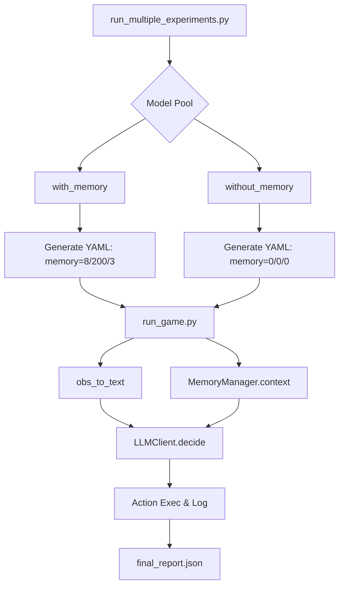
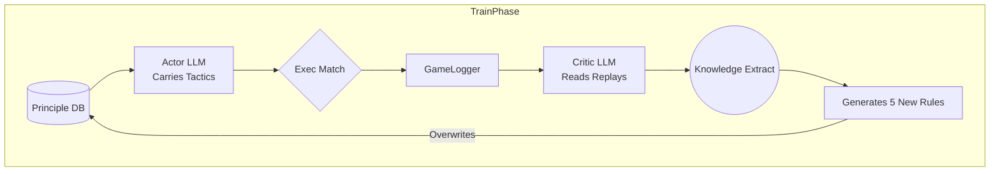
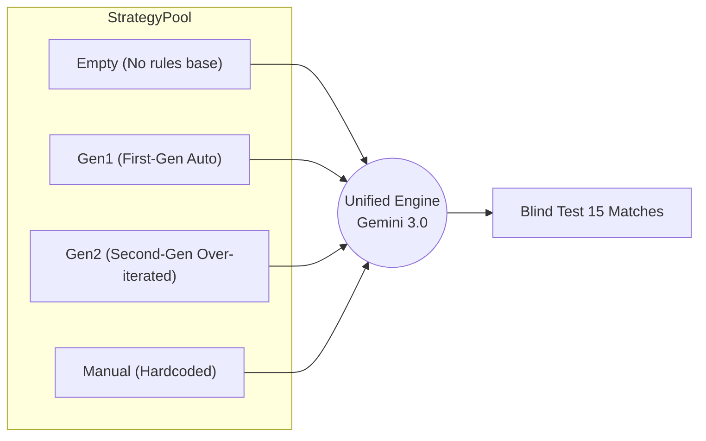

# 🏆 Clash of Gods · Leaderboard

Here is the latest evaluation record under the `academy_3_vs_1_with_keeper` scenario.

This page accumulates two core sets of empirical data:
- **Part 1: Multi-branch Competence Blind Test across LLMs (Memory Ablation)**
- **Part 2: Tactical Auto-Evolution and Comparative Evaluation (Strategy Evolution Test)**

<LeaderboardTable :leaderboardData="data" />

---

# Part 1: Competencies and Memory Mechanism Ablation
*Based on `experiment_logs/exp_20260305_122129`*

## 1. Experimental Architecture

### 1.1 Architectural Layers
1. **Orchestration Layer** (`run_multiple_experiments.py`)
   - Traverses model lists, anchoring two branches per model: `with_memory` / `without_memory`
2. **Execution Layer** (`llm_football_agent/run_game.py`)
   - Injects the memory context into prompts and requests LLM decisions every `interval` step.
3. **Memory Layer** (`llm_football_agent/memory.py`)
   - Working Memory: Recent decision window; Episodic Memory: Historical episode retrieval.
4. **Gateway Layer** (`llm_football_agent/llm_client.py`)
   - Unified provider adaptation, retries, and rate limiting.

### 1.2 Data Flow (Multi-Model Evaluation)

## 2. Core Data Analysis (With vs. Without Memory)

| Model | Score(with) | Score(without) | ΔScore | Reward Δ | Steps Δ | Tokens Δ | P95 Latency Δ(s) |
|---|---:|---:|---:|---:|---:|---:|---:|
| **Gemini-3.0-Flash** | 10% | 0% | **+10 pct** | +0.15 | -21.8 | -17k | +8.65 |
| DeepSeek-V3.2 | 10% | 10% | 0 pct | -0.02 | +16.5 | +620k | -0.36 |
| Grok-4.1-Fast | 0% | 0% | 0 pct | +0.02 | +67.0 | +1.39M | +0.31 |

> **Conclusion**: In the current batch, the "stable gains" of Memory are not universal. **Gemini-3.0-Flash is the singular positive sample**, boosting scoring rate, rewards, and finish efficiency with almost flat token costs. The penalty is largely reflected in increased P95 latency due to long context processing.

### Performance Effectiveness Visualization

 
 

---

# Part 2: Tactical Evolution & Comparative Test
*Based on `experiment_logs/test_20260305_145857`*

## 1. Architecture and Setup

The system introduces a decoupled two-stage design: Variables are controlled by testing different revolutionary sets of tactics developed by the “Agent Coach”.

### 1.1 Train Phase: Tactical Self-Evolution (`run_evolution_experiments.py`)
Models start from a "0-principle" blind test, autonomously iterating tactical principles through practical error feedback and post-match reviews by a Critic LLM.

### 1.2 Test Phase: Strategy Ablation (`run_test_experiments.py`)

## 2. Quantitative Results & Performance Graph

**Parameters**: 15 episodes/strategy, max 200 steps lagging judgement, unified Gemini 3.0 Flash driving engine.

| Strategy Tier | Tactical Features | Win Rate | Score / Total | Avg Steps |
|:--- | :--- | :---: | :---: | :---: |
| **🥇 Gen1 Evolved** | *"Pass immediately upon interception... shoot decisively"* (Clear verbs) | **53.3%** | 8/15 | **113.6 Steps** |
| **🥈 Gen2 Evolved** | *"Iron-wall defense... decisive finish"* (Ornate phrasing) | 40.0% | 6/15 | 132.3 Steps |
| **🥉 Manual Original** | Contains rigid math thresholds: *(“Shoot if x>0.85”)* | 33.3% | 5/15 | 145.3 Steps |
| **📉 Empty (No Rules)** | (Baseline purely relying on pre-training instincts) | 20.0% | 3/15 | 170.4 Steps |

### Visualization Radar (Win Rate vs. Time Consumption)
*(Blue bars denote win rate, higher is better; Red paths denote single-match execution speed, lower is crisper)*

## 3. Core Discoveries (Findings)

1. **Absolute Dominance of Natural Language Prompts on Embodied Action**
   Comparing the `Empty` strategy (20%) to the `Gen1` strategy (53.3%): Fixing the underlying intelligence model, the sole provision of 5 high-dimensional language rules triggered an astronomical **+166% surge** in the agent's win rate.
2. **LLM Self-Supervised Generation Crushes Human Priors**
   The autonomously generated `Gen1` tactics easily toppled developers' hardcoded `Manual` guidelines. Attentional phrases (Prompts) conceived by an LLM natively align much better with the interpretation mechanism of fellow LLMs during the execution layer.
3. **Over-iteration triggers "Semantic Misalignment"**
   The win rate regression in `Gen2` exposes a common fallacy in evaluating models (Critic): Intending to achieve perfection, it layered grandiose metaphysical terminology ("dynamic support", "iron-wall defense"). When discrete operational logic (passing/shooting) fails to translate these elevated adjectives, capability deteriorates—showcasing structural LLM hallucination and theoretical overfitting.

## 4. Future Roadmap
- [ ] Implement dual cross-validation of **Memory + Dynamic Prompt** utilizing datasets from Parts 1 & 2.
- [ ] Pioneer **VLM Mulit-modal** interception, passing 2D top-down rendered match snapshots to bypass spatial blocking constraints inherent in raw `(x, y)` text coordinates.
