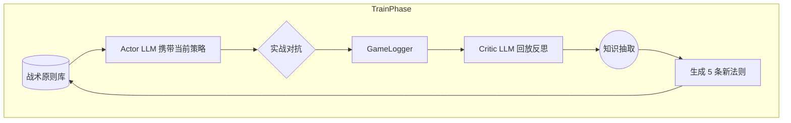
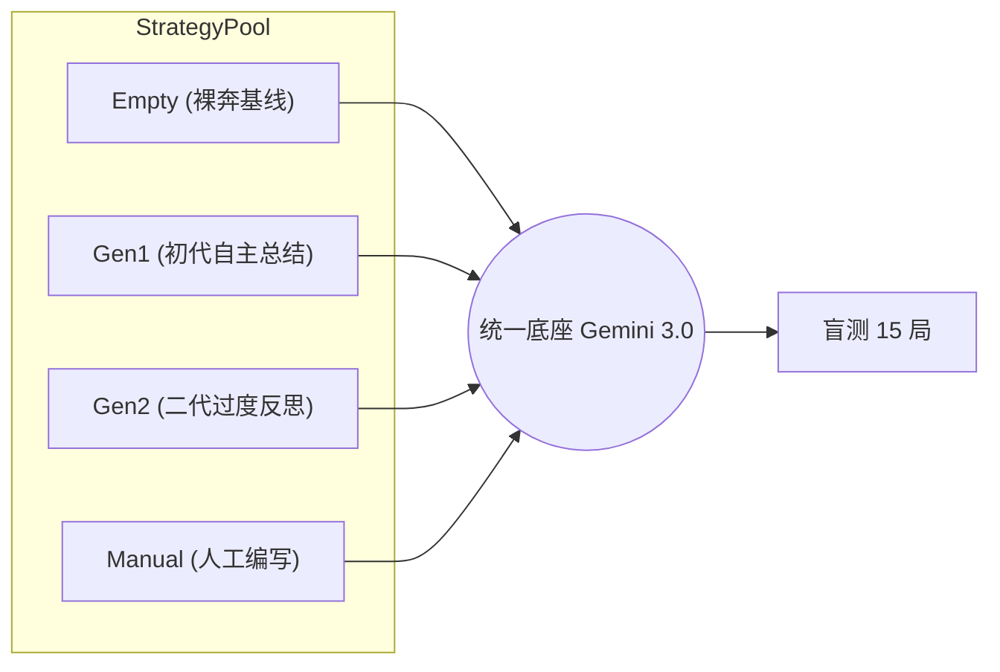

# LLM-Football Agent: 战术进化与策略对照评测 (Evolution & Test)
*基于 `experiment_logs/test_20260305_145857`*

## 1. 核心架构与实验设定

本系统引入了两阶段分离设计：控制变量，依次评测经过“智能体教练”不同演化世代的战术表现。

### 1.1 Train 阶段：战术自我进化 (`run_evolution_experiments.py`)
模型从“0原则”盲测开始，通过实战报错与教练（Critic API）的回放复盘，自主迭代战术原则。

### 1.2 Test 阶段：策略消融测试 (`run_test_experiments.py`)

## 2. 定量实验数据与性能图谱

**测试参数**：15 回合/策略，最大 200 步落后判定，同一 Gemini Flash 底座引擎。

| 策略梯队 | 战术特征简述 | 盲测胜率 | 进球率 | 平均耗时 |
|:--- | :--- | :---: | :---: | :---: |
| **🥇 Gen1 Evolved** | *“遭遇拦截立即传球... 果断起脚射门”* (动词精确) | **53.3%** | 8/15 | **113.6 步** |
| **🥈 Gen2 Evolved** | *“抢占球权... 果断终结... 铁壁防守”* (辞藻华丽) | 40.0% | 6/15 | 132.3 步 |
| **🥉 Manual Original** | 包含强数学逻辑：*(“如 x>0.85 则射门”)* | 33.3% | 5/15 | 145.3 步 |
| **📉 Empty (无原则)** | (控投组，仅凭预训练本能) | 20.0% | 3/15 | 170.4 步 |

### 可视化雷达 (胜率 vs 代价)
*(蓝柱体代表胜率，越高越好；红线代表单局耗时极化，越低越好)*

## 3. 核心研究发现 (Findings)

1. **自然语言 Prompt 对具身动作的越级统治力**
   对比 `Empty` 策略(20%) 和 `Gen1` 策略(53.3%)：在底层模型不变的情况下，仅仅注入 5 行高维语言规则指导，智能体的胜率即刻飙升 **+166%**。
2. **LLM 自监督生成 碾压 人类先验知识**
   系统自主产出的 `Gen1` 策略，远胜人类硬编码的 `Manual` 指引。LLM 生成的注意力词组（Prompt）在执行层天然更契合同族群大模型的映射机制。
3. **过度迭代引发“语义对齐坍塌”**
   `Gen2` 的胜率发生了回滚。这揭示了作为评价模型（Critic）的通病：为了“精益求精”，它堆砌了诸如“动态接应”、“铁壁防守”类高阶且形而上的大词。当这些描述无法被低层的 Actor LLM 准确平移到离散操作（传球/射门）上时，反而导致了表现力的下降（模型幻觉/理论过拟合）。

## 4. 后续演进 (Future Roadmap)
- [ ] 结合以上 Part 1 与 Part 2，进行 **Memory + Dynamic Prompt** 的双重交叉验证。
- [ ] 尝试引入 **VLM多模态** 读取球场渲染快照，解决纯文本坐标系在空间阻挡计算上的短板。
