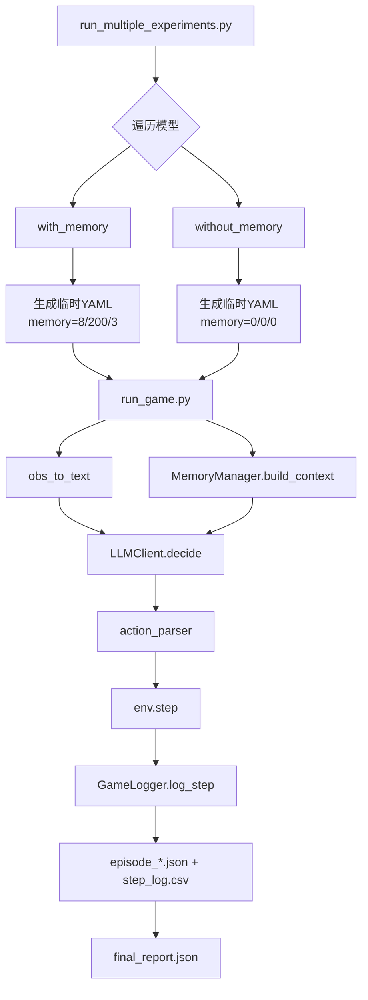
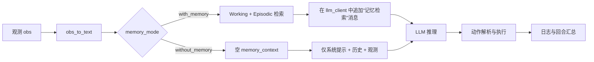

# 🏆 诸神之战 · 排行榜

这里是 `academy_3_vs_1_with_keeper` 场景下的最新评测全记录。

本页新增了基于 `experiment_logs/exp_20260305_122129` 的完整分析报告（含 with/without memory 消融、架构图、数据表与图像）。

<LeaderboardTable :leaderboardData="data" />

## 1) 实验架构（对应 run_multiple_experiments.py）

### 1.1 架构分层

1. **实验编排层**（`run_multiple_experiments.py`）
   - 遍历模型列表 `MODELS_TO_TEST`
   - 对每个模型固定跑两支分支：`with_memory` / `without_memory`
   - 自动生成临时 config，调用 `llm_football_agent/run_game.py`

2. **执行层**（`llm_football_agent/run_game.py`）
   - 创建 GRF 环境
   - 每隔 `interval` 步调用 LLM 决策
   - 把 memory context 拼到 prompt 后再请求模型
   - 每步写入 `step_log.csv`，每局写 `episode_*.json`，最终写 `final_report.json`

3. **记忆层**（`llm_football_agent/memory.py`）
   - Working Memory：最近决策窗口
   - Episodic Memory：历史回合摘要（检索 top-k）
   - `build_context()` 生成“记忆检索”文本，注入当前 LLM 请求

4. **LLM 网关层**（`llm_football_agent/llm_client.py`）
   - 统一 provider 适配（OpenAI-compatible / Gemini-native / Qwen）
   - 统一重试、超时、token 统计

### 1.2 主框图（批量实验）

### 1.3 with / without memory 数据流差异

## 2) 实验设定（exp_20260305_122129）

- 场景：`academy_3_vs_1_with_keeper`
- 每模型双分支：`with_memory` 与 `without_memory`
- 每分支回合数：`10`
- 每局最大步数：`200`
- LLM 调用间隔：`5` 步
- 统计来源：`final_report.json` + `step_log.csv`
- 当前完成模型对数：`5`（共 `10` 个 session）

原始数据文件：
- `docs/public/analysis/exp_20260305_122129/raw_runs.csv`
- `docs/public/analysis/exp_20260305_122129/paired_comparison.csv`
- `docs/public/analysis/exp_20260305_122129/summary.json`

## 3) 数据分析（跨模型 with-vs-without）

### 3.1 配对对比表（核心指标）

| Model | Score(with) | Score(without) | ΔScore | Reward Δ | Steps Δ | Tokens Δ | P95延迟 Δ(s) | Timeout Δ |
|---|---:|---:|---:|---:|---:|---:|---:|---:|
| DeepSeek-V3.2 | 10% | 10% | 0 pct | -0.02 | +16.5 | +620,207 | -0.36 | 0.00 pct |
| Gemini-3.0-Flash | 10% | 0% | +10 pct | +0.15 | -21.8 | -17,062 | +8.65 | +2.44 pct |
| Grok-4.1-Fast-Non-Reasoning | 0% | 0% | 0 pct | +0.02 | +67.0 | +1,399,042 | +0.31 | 0.00 pct |
| gemini_2_5_flash | 0% | 0% | 0 pct | +0.00 | +10.2 | -513,777 | +105.84 | +48.62 pct |
| gpt-5-mini | 0% | 0% | 0 pct | +0.01 | +2.1 | +249,139 | +7.88 | 0.00 pct |

说明：
- `Δ = with_memory - without_memory`
- `Steps Δ < 0` 表示 with_memory 更快结束

### 3.2 图像分析

#### (A) 效果增益图（胜率/奖励/步数）

#### (B) 成本与稳定性图（Token/P95/超时率）

### 3.3 Gemini-3.0-Flash 专项时序图

Gemini-3.0-Flash（同批次主对照）关键数字：

| 指标 | with memory | without memory | 差值 |
|---|---:|---:|---:|
| 胜率 | 10.0% | 0.0% | +10.0 pct |
| 进球局数 | 1/10 | 0/10 | +1 |
| 平均奖励 | 0.93 | 0.78 | +0.15 |
| 平均步数 | 54.5 | 76.3 | -21.8 |
| 总Token | 1,152,599 | 1,169,661 | -17,062 |
| P95延迟(ms) | 39,477.61 | 30,824.61 | +8,653.00 |
| 超时率 | 8.77% | 6.33% | +2.44 pct |

## 4) exp 历史记录校验

历史中另有早期样本：
- `experiment_logs/exp_20260305_122023/Gemini-3.0-Flash_with_memory/session_20260305_122024/final_report.json`

该样本呈现：
- `total_tokens = 0`
- `latency_p95_ms = 14.06`

与当前批次的真实在线调用分布明显不一致，因此在本页中作为**异常样本**记录，不并入主结论统计。

## 5) 结论

1. **在当前批次里，memory 的“稳定收益”并不普遍**：5 个模型中，仅 Gemini-3.0-Flash 在胜率上获得明确增益（+10 pct）。
2. **Gemini-3.0-Flash 是 memory 的正样本**：得分能力、奖励、结束效率均提升，且 token 成本几乎持平。
3. **memory 的代价主要体现在稳定性而非 token**：多个模型出现更高延迟或超时率，尤其 gemini_2_5_flash 的超时率显著恶化。
4. **工程建议**：后续应把 memory 检索与提示注入做“条件触发”与“预算约束”，优先优化超时与重试链路，再评估普适收益。

---

以上分析与图像均由本仓库当前实验数据自动汇总生成，数据源固定为 `exp_20260305_122129`（主）+ `exp_20260305_122023`（异常校验）。
