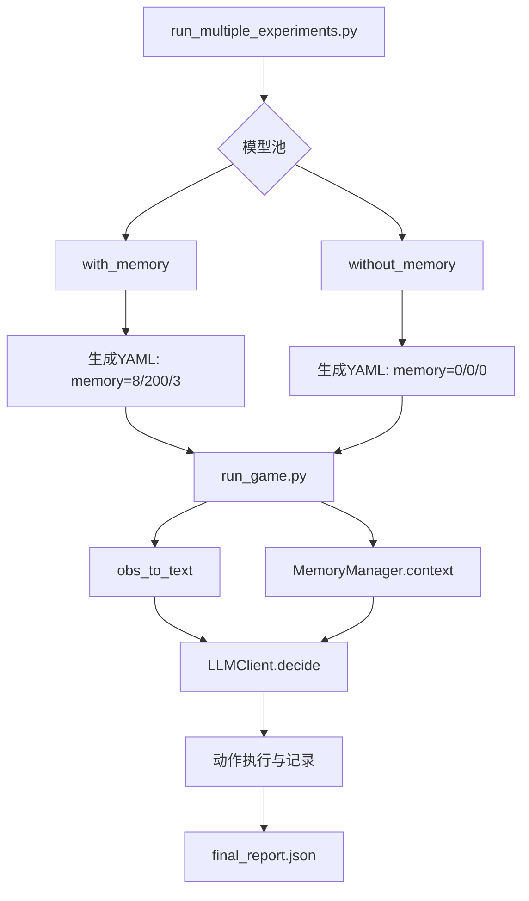
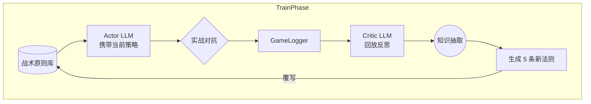
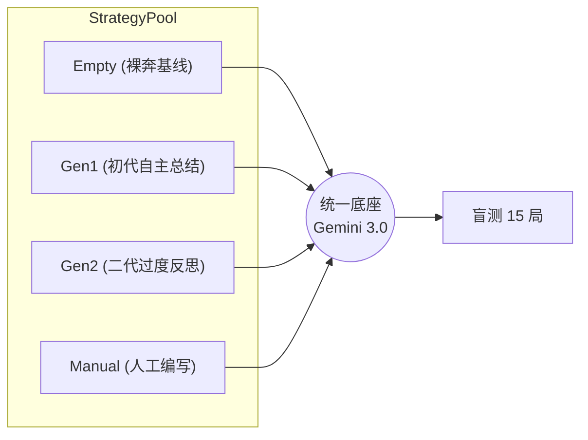

# 🏆 诸神之战 · 排行榜

这里是 `academy_3_vs_1_with_keeper` 场景下的最新评测全记录。

本页汇总了两部分核心实测数据：
- **Part 1：各路大模型的多分支实战能力盲测 (Memory Ablation)**
- **Part 2：战术自动进化与量化对照评测 (Strategy Evolution Test)**

<LeaderboardTable :leaderboardData="data" />

---

# Part 1: 多模型能力与记忆机制消融 (Memory Ablation)
*基于 `experiment_logs/exp_20260305_122129`*

## 1. 实验架构

### 1.1 架构分层
1. **实验编排层**（`run_multiple_experiments.py`）
   - 遍历模型列表，对每个模型固定跑两支分支：`with_memory` / `without_memory`
2. **执行层**（`llm_football_agent/run_game.py`）
   - 每隔 `interval` 步调用 LLM 决策，把 memory context 拼到 prompt 后请求模型
3. **记忆层**（`llm_football_agent/memory.py`）
   - Working Memory：最近决策窗口；Episodic Memory：历史回合摘要（检索 top-k）
4. **LLM 网关层**（`llm_football_agent/llm_client.py`）
   - 统一 provider 适配与重试限流

### 1.2 主框图（多模型评测数据流）

## 2. 核心数据分析 (with-vs-without)

| Model | Score(with) | Score(without) | ΔScore | Reward Δ | Steps Δ | Tokens Δ | P95延迟 Δ(s) |
|---|---:|---:|---:|---:|---:|---:|---:|
| **Gemini-3.0-Flash** | 10% | 0% | **+10 pct** | +0.15 | -21.8 | -17k | +8.65 |
| DeepSeek-V3.2 | 10% | 10% | 0 pct | -0.02 | +16.5 | +620k | -0.36 |
| Grok-4.1-Fast | 0% | 0% | 0 pct | +0.02 | +67.0 | +1.39M | +0.31 |

> **结论**：在当前批次里，Memory 的“稳定收益”并不普遍。**Gemini-3.0-Flash 是唯一的明确正样本**，得分率、奖励、结束效率均提升，且 token 成本几乎持平。代价主要体现在长文本带来的 P95 延迟升高。

### 图形化效果增益对比

 
 

---

# Part 2: 战术进化与策略对照评测 (Evolution & Test)
*基于 `experiment_logs/test_20260305_145857`*

## 1. 核心架构与实验设定

系统引入了两阶段分离设计：控制变量，依次评测经过“智能体教练”不同演化世代的战术表现。

### 1.1 Train 阶段：战术自我进化 (`run_evolution_experiments.py`)
模型从“0原则”盲测开始，通过实战报错与教练（Critic API）的回放复盘，自主迭代战术原则。

### 1.2 Test 阶段：策略消融测试 (`run_test_experiments.py`)

## 2. 定量实验数据与性能图谱

**测试参数**：15 回合/策略，最大 200 步落后判定，同一 Gemini Flash 底座引擎。

| 策略梯队 | 战术特征简述 | 盲测胜率 | 进球率 | 平均耗时 |
|:--- | :--- | :---: | :---: | :---: |
| **🥇 Gen1 Evolved** | *“遭遇拦截立即传球... 果断起脚射门”* (动词精确) | **53.3%** | 8/15 | **113.6 步** |
| **🥈 Gen2 Evolved** | *“抢占球权... 果断终结... 铁壁防守”* (辞藻华丽) | 40.0% | 6/15 | 132.3 步 |
| **🥉 Manual Original** | 包含强数学逻辑：*(“如 x>0.85 则射门”)* | 33.3% | 5/15 | 145.3 步 |
| **📉 Empty (无原则)** | (控投组，仅凭预训练本能) | 20.0% | 3/15 | 170.4 步 |

### 可视化雷达 (胜率 vs 代价)
*(蓝柱体代表胜率，越高越好；红线代表单局耗时极化，越低越好)*

## 3. 核心研究发现 (Findings)

1. **自然语言 Prompt 对具身动作的越级统治力**
   对比 `Empty` 策略(20%) 和 `Gen1` 策略(53.3%)：在底层模型不变的情况下，仅仅注入 5 行高维语言规则指导，智能体的胜率即刻飙升 **+166%**。
2. **LLM 自监督生成 碾压 人类先验知识**
   系统自主产出的 `Gen1` 策略，远胜人类硬编码的 `Manual` 指引。LLM 生成的注意力词组（Prompt）在执行层天然更契合同族群大模型的映射机制。
3. **过度迭代引发“语义对齐坍塌”**
   `Gen2` 的胜率发生了回滚。这揭示了作为评价模型（Critic）的通病：为了“精益求精”，它堆砌了诸如“动态接应”、“铁壁防守”类高阶且形而上的大词。当这些描述无法被低层的 Actor LLM 准确平移到离散操作（传球/射门）上时，反而导致了表现力的下降（模型幻觉/理论过拟合）。

## 4. 后续演进 (Future Roadmap)
- [ ] 结合以上 Part 1 与 Part 2，进行 **Memory + Dynamic Prompt** 的双重交叉验证。
- [ ] 尝试引入 **VLM多模态** 读取球场渲染快照，解决纯文本坐标系在空间阻挡计算上的短板。
