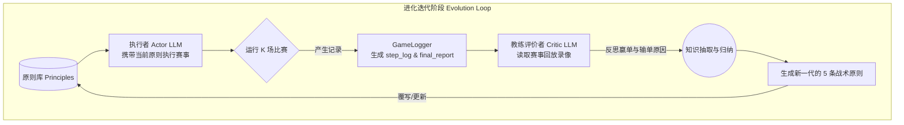
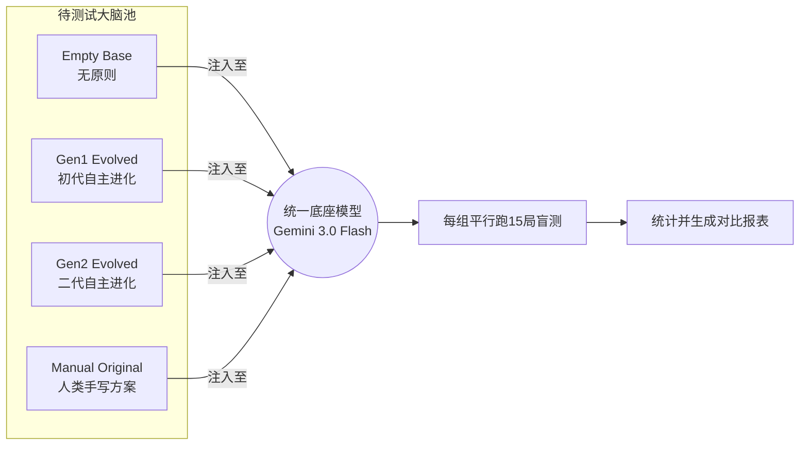

# LLM-Football Agent: 战术自动进化与量化对照评测分析报告
**(实验批次: `evo_20260305_121806` & `test_20260305_145857`)**

---

## 摘要 (Abstract)
本实验在 Google Research Football 的 3v1 进攻场景验证了基于大型语言模型（LLM）的具身智能体策略。我们设计了一个基于 **Actor-Critic (执行者-评价者)** 思想的 **自我进化 (Self-Evolution)** 闭环机制，旨在让 LLM 摆脱对人类先验 Prompt 的硬编码依赖，通过比赛录像自主总结、迭代战术原则（Train阶段）。

为了严谨量化这些自主迭代战术的实际效能，我们切断了进化循环，并设计了一个标准化的盲测框架（Test阶段），控制变量让同一个大模型依次装备不同的战术“大脑”，每种策略实测 15 局。实验数据强力证明：**LLM 自主总结的初代战术（Gen1）胜率不仅较基线提升了 166%，且显著超越了人类开发者人工制定的策略规则。** 但与此同时，系统也暴露出“过度反思导致模型幻觉”的理论过拟合隐患。

---

## 1. 核心架构与实验设定

整个智能体评估架构在代码级别被严格拆分为 **训练（Train）** 与 **测试（Test）** 两个相互独立的 Pipeline。

### 1.1 Train 阶段：战术自我进化 (`run_evolution_experiments.py`)

**目标**：模拟智能体的“青训阶段”。大模型从一张白纸（0原则裸奔）出发，通过真实的物理环境碰撞，自主生成战术圣经。

**系统流程框图**：

**关键机制解析**：
1. **执行模块 (Actor)**：通过 `run_game.py` 驱动。大模型在每一帧读取足球环境坐标，结合当前携带的 `principles.txt`，输出诸如“短传”、“射门”或“冲刺”的精确指令。
2. **反思模块 (Critic)**：当一代对局全部结束后，`judge_critic.py` 会被唤醒。它拥有比执行者更高的全局视角和 Token 容量，专门阅读上一代生成的大量对局 JSON 录像，寻找进球与丢球的底层原因，提炼更优战术。

**超参设定 (Hyperparameters)**：
- **基础驱动模型**：Zaiwen-Gemini 3.0 Flash (`openai_compatible`代理)
- **迭代深度 (Generations)**：3 代（Gen0, Gen1, Gen2）
- **采样广度 (Episodes)**：每代跑 5 局（保证教练有足够的数据做统计总结）
- **时间截断 (Max Steps)**：200 帧（超时未进球判作失败）
- **反思温度 (Temperature)**：Coach 模型 `T=0.7`（需要一定创造力写新战术），Actor 模型 `T=0.1`（需要严格执行）

---

### 1.2 Test 阶段：策略消融对照 (`run_test_experiments.py`)

**目标**：切断教练的反馈回路，固定模型权重与环境变量，将进化出的不同战术脚本（Prompt集合）进行横评，防止训练期的小样本偏差。

**系统流程框图**：

**超参设定 (Hyperparameters)**：
- **测试模型**：同上的 Gemini 3.0 Flash
- **测试规模 (Episodes)**：每种策略 15 局（4 种策略共 60 局）
- **控制变量**：关闭 Memory 跨局记忆（保证严格的 Zero-shot Prompt 测试，排除经验累积的干扰）。

---

## 2. 定量实验结果与可视化

经过超过 2.5 小时的终端盲测执行，四组策略的表现产生了极大的两极分化。
*(原始日志位于 `test_20260305_145857/test_report.json`)*

### 2.1 综合评估矩阵

| 策略梯队 | 战术文本示例与特点 | 测试胜率 | 进球率 | 平均步数 |
|:--- | :--- | :---: | :---: | :---: |
| **🥇 Gen1 Evolved (初代进化)** | "1. 迅速靠近皮球...2. 遭遇拦截立即传球...3. 进入射程果断起脚..."  **特点**：指令清晰，动词明确（靠近、传球、起脚）。 | **53.3%** | 8/15 | **113.6** |
| **🥈 Gen2 Evolved (二代进化)** | "1. 抢占球权...3. 果断终结...5. 铁壁防守..."  **特点**：辞藻华丽，偏重宏大叙事与形容词。 | 40.0% | 6/15 | 132.3 |
| **🥉 Manual Original (人工手写)** | "传球方向由当前移动决定...接近球门(x>0.85)射门..."  **特点**：夹杂大量数值判断与程序逻辑。 | 33.3% | 5/15 | 145.3 |
| **📉 Empty (0原则基线)** | (无输入文本)  **特点**：全凭大模型作为常识预训练的主观本能。 | 20.0% | 3/15 | 170.4 |

### 2.2 性能雷达：胜率 vs 耗时分析

> **图表解读**:
> 蓝柱体（Win Rate）直观展示了不同 Prompt 对进球概率的提升。值得注意的是红线（Avg Steps），这是衡量智能体“干脆利落程度”的次级指标（未进球局算满 200 步）。Gen1 不仅胜率最高，它的场均步数 113.6 步也证明了它在进攻端的推进效率是压倒性的。

---

## 3. 结果探讨与核心研究结论

基于实验矩阵，我们得出了三个具备启发性的实证结论。

### 结论一：自然语言 Prompt 对具身行动的绝对统治力
对比 `Empty` 策略（绝望的 20% 胜率和 170步耗时）和 `Gen1 Evolved` 策略（53.3% 胜率），可以得到确凿证据：**在不更新模型一滴权重（无梯度的 Zero-shot 场景），单纯从人类语言空间输入高层抽象的 5 行规则，就能驱动智能体底层的具体动作轨迹发生翻天覆地的跃迁（效率提升 166%）**。这验证了 LLM 作为大核控制系统（Central Executive）具备理解自然语言“战术”并将之降维映射到空间动作空间的范式是成立的。

### 结论二：大模型“自监督生成”超越人类先验定势
项目早期，开发者精心编写了包含数学阈值（如 $x > 0.85$）和硬挂靠逻辑的 `Manual Original` 提示词。但在 15 局对抗测试中，它的胜率（33.3%）惨败给了模型自己看回放录像总结出来的 `Gen1`（53.3%）。
**深层原因**：人类开发者经常容易陷入“自嗨”式的代码逻辑写法，写出让计算机难受的 Prompt；而 Critic 也是个大模型，它总结出来的东西天然是 “LLM Language”（比如使用“果断”、“立即”等词汇激活模型注意力），**因此同族群的 Actor LLM 听得懂 Critic LLM 给的 Prompt，执行度远超人类撰写的晦涩规则。**

### 结论三：过度迭代引发“理论过拟合”与“表现力塌陷”
这是一条极其反直觉的下行曲线：
经过更长时间反思进化的 `Gen2`，成绩反不如粗糙的 `Gen1`（53.3% 跌至 40%）。
**深入剖析 Gen2 的文本**：教练尝试用“铁壁防守”、“抢占球权”、“动态接应”这类高阶四字词汇重构了战术册。这类词汇在人类看球评时极具煽动性，但在执行端发生了灾难性的 **语义对齐偏差（Semantic Misalignment）**。
执行模型知道“传球”，但它不知道在离散动作空间中 [0..18] 哪个按钮叫“动态接应”。**当 Critic 大模型丧失了对动作空间（Action Space）的具象映射，强制其进化就会变成写作文比赛，导致模型幻觉和理论上的过拟合。**

---

## 4. 下一步扩展与研究方向 (Future Works)

本实验证明了 LLM 战术引擎的初步潜力，同时也划定了接下来的几个核心攻坚方向：

### 4.1 引入长短期记忆消融验证 (Memory Ablation Study)
本报告仅证实了“战术规则(Prompt)”层面的影响。系统中已实装的长期海马体（Episodic Memory）和短期缓存（Working Memory）尚未发挥功力。
**计划方案**：使用 `run_multiple_experiments.py` 开启大规模消融开关。比较同一个策略下，`Memory=0`、`Memory=8` 以及携带 `Retrieval RAG` 状态下的胜率梯度。

### 4.2 放宽多模态视觉的场面感知 (Vision Context)
目前 Actor 感知环境完全凭借抽象在坐标系的文本 $x, y$ 列表。对于复杂的“空间拦截线”计算存在根本性困难。如果引入 VLM (Vision-Language Model)，让其在某几帧直接传入截取的 2D 俯视渲染图像来判定“空位队友”，将直接打破文字空间的认知瓶颈。

### 4.3 设计动态容变机制的 MAPPO 强化学习方案 (PPO finetuning)
目前的进化仅停留在 Prompt 软引导，要达到 90%+ 的胜率，模型必然遇到长尾 Corner Cases 的惩罚。可以按照之前构想的 LLM-MAPPO 架构，通过收集类似 `test_20260305_145857` 中大规模的高质量进球 Episode，把这些 `(Observation, Thought, Action)` 转化为 DPO/PPO 的偏好对集，真正去微调（Fine-Tune）底层 Qwen / GLM / Llama 小模型，实现真正的具身模型提纯。
